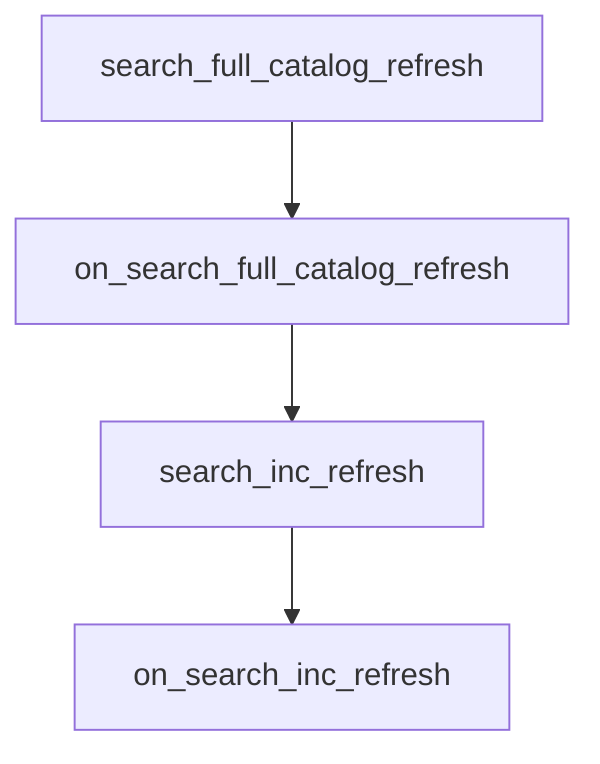
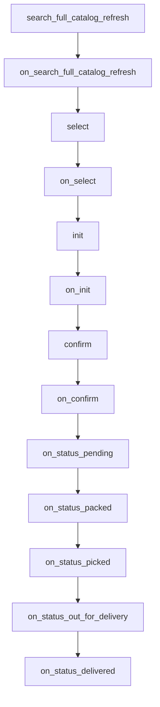
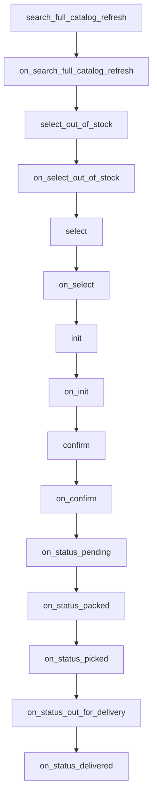
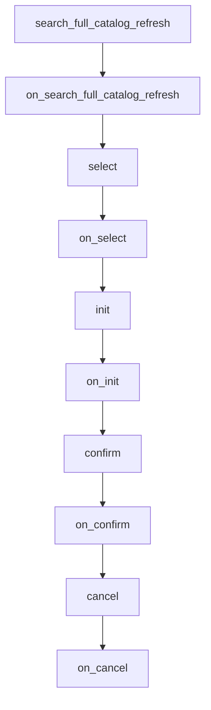
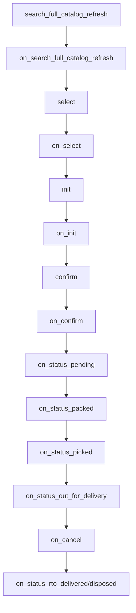

# Flow Definitions

## Flow 1

```mermaid
graph TD
    search_full_catalog_refresh["search_full_catalog_refresh"] --> on_search_full_catalog_refresh["on_search_full_catalog_refresh"]
    on_search_full_catalog_refresh --> search_inc_refresh["search_inc_refresh"]
    search_inc_refresh --> on_search_inc_refresh["on_search_inc_refresh"]
```

## Flow 2

```mermaid
graph TD
    search_full_catalog_refresh["search_full_catalog_refresh"] --> on_search_full_catalog_refresh["on_search_full_catalog_refresh"]
    on_search_full_catalog_refresh --> select["select"]
    select --> on_select["on_select"]
    on_select --> init["init"]
    init --> on_init["on_init"]
    on_init --> confirm["confirm"]
    confirm --> on_confirm["on_confirm"]
    on_confirm --> on_status_pending["on_status_pending"]
    on_status_pending --> on_status_packed["on_status_packed"]
    on_status_packed --> on_status_picked["on_status_picked"]
    on_status_picked --> on_status_out_for_delivery["on_status_out_for_delivery"]
    on_status_out_for_delivery --> on_status_delivered["on_status_delivered"]
```

## Flow 3

```mermaid
graph TD
    search_full_catalog_refresh["search_full_catalog_refresh"] --> on_search_full_catalog_refresh["on_search_full_catalog_refresh"]
    on_search_full_catalog_refresh --> select_out_of_stock["select_out_of_stock"]
    select_out_of_stock --> on_select_out_of_stock["on_select_out_of_stock"]
    on_select_out_of_stock --> select["select"]
    select --> on_select["on_select"]
    on_select --> init["init"]
    init --> on_init["on_init"]
    on_init --> confirm["confirm"]
    confirm --> on_confirm["on_confirm"]
    on_confirm --> on_status_pending["on_status_pending"]
    on_status_pending --> on_status_packed["on_status_packed"]
    on_status_packed --> on_status_picked["on_status_picked"]
    on_status_picked --> on_status_out_for_delivery["on_status_out_for_delivery"]
    on_status_out_for_delivery --> on_status_delivered["on_status_delivered"]
```

## Flow 4

```mermaid
graph TD
    search_full_catalog_refresh["search_full_catalog_refresh"] --> on_search_full_catalog_refresh["on_search_full_catalog_refresh"]
    on_search_full_catalog_refresh --> select["select"]
    select --> on_select["on_select"]
    on_select --> init["init"]
    init --> on_init["on_init"]
    on_init --> confirm["confirm"]
    confirm --> on_confirm["on_confirm"]
    on_confirm --> cancel["cancel"]
    cancel --> on_cancel["on_cancel"]
```

## Flow 5

```mermaid
graph TD
    search_full_catalog_refresh["search_full_catalog_refresh"] --> on_search_full_catalog_refresh["on_search_full_catalog_refresh"]
    on_search_full_catalog_refresh --> select["select"]
    select --> on_select["on_select"]
    on_select --> init["init"]
    init --> on_init["on_init"]
    on_init --> confirm["confirm"]
    confirm --> on_confirm["on_confirm"]
    on_confirm --> on_status_pending["on_status_pending"]
    on_status_pending --> on_status_packed["on_status_packed"]
    on_status_packed --> on_status_picked["on_status_picked"]
    on_status_picked --> on_status_out_for_delivery["on_status_out_for_delivery"]
    on_status_out_for_delivery --> on_cancel["on_cancel"]
    on_cancel --> on_status_rto_delivered_disposed["on_status_rto_delivered/disposed"]
```

## Flow 6

```mermaid
graph TD
    search_full_catalog_refresh["search_full_catalog_refresh"] --> on_search_full_catalog_refresh["on_search_full_catalog_refresh"]
    on_search_full_catalog_refresh --> select["select"]
    select --> on_select["on_select"]
    on_select --> init["init"]
    init --> on_init["on_init"]
    on_init --> confirm["confirm"]
    confirm --> on_confirm["on_confirm"]
    on_confirm --> on_update_part_cancel["on_update_part_cancel"]
    on_update_part_cancel --> update_settlement_part_cancel["update_settlement_part_cancel"]
    update_settlement_part_cancel --> on_status_pending["on_status_pending"]
    on_status_pending --> on_status_packed["on_status_packed"]
    on_status_packed --> on_status_picked["on_status_picked"]
    on_status_picked --> on_status_out_for_delivery["on_status_out_for_delivery"]
    on_status_out_for_delivery --> on_status_delivered["on_status_delivered"]
    on_status_delivered --> update_reverse_qc["update_reverse_qc"]
    update_reverse_qc --> on_update_interim_reverse_qc["on_update_interim_reverse_qc"]
    on_update_interim_reverse_qc --> on_update_approval["on_update_approval"]
    on_update_approval --> on_update_picked["on_update_picked"]
    on_update_picked --> update_settlement_reverse_qc["update_settlement_reverse_qc"]
    update_settlement_reverse_qc --> on_update_delivered["on_update_delivered"]
    on_update_delivered --> update_liquidated["update_liquidated"]
    update_liquidated --> on_update_interim_liquidated["on_update_interim_liquidated"]
    on_update_interim_liquidated --> on_update_liquidated["on_update_liquidated"]
    on_update_liquidated --> update_settlement_liquidated["update_settlement_liquidated"]
```
